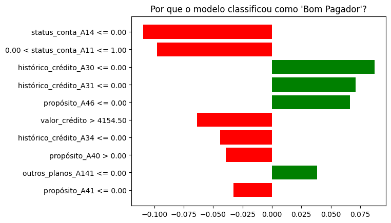
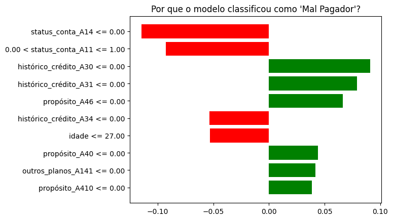

# Decifrando a Caixa Preta: Tornando Modelos de IA Explicáveis com LIME

Este projeto aplica técnicas de *Explainable Artificial Intelligence (XAI)* no contexto de concessão de crédito bancário. A partir de um modelo preditivo treinado com o **German Credit Data**, utilizamos a biblioteca [LIME](https://github.com/marcotcr/lime) para gerar explicações locais sobre as decisões do modelo para cada cliente.

---

## Objetivo

- Criar um modelo de machine learning para classificar clientes como **bom** ou **mal pagador**.
- Aplicar a técnica **LIME** para gerar explicações individuais, claras e interpretáveis para decisões de concessão ou negação de crédito.
- Atender às necessidades de **clientes, gerentes e órgãos regulatórios**, promovendo transparência e confiabilidade.

---

## Dataset: German Credit Data

- **Fonte:** [UCI Machine Learning Repository](https://archive.ics.uci.edu/ml/datasets/statlog+(german+credit+data))
- **Registros:** 1000 clientes
- **Atributos:** 20 (como idade, status da conta, histórico de crédito, renda, emprego, etc.)
- **Alvo:**  
  - 1 = Bom pagador  
  - 2 = Mal pagador

> Utilizamos o arquivo original `german.data`, realizando o pré-processamento com `get_dummies` para variáveis categóricas.

---

## Tecnologias Utilizadas

- Python 3
- pandas, numpy, matplotlib
- scikit-learn (modelo Random Forest)
- LIME (Local Interpretable Model-Agnostic Explanations)
- fpdf (geração de relatório em PDF)

---

## Modelo Preditivo

- **Tipo:** Classificação binária
- **Modelo escolhido:** `RandomForestClassifier`
- **Motivos:**
  - Alta acurácia
  - Robustez a dados ruidosos
  - Compatível com interpretabilidade via LIME

---

## Etapas do Projeto

1. Leitura e nomeação das colunas do dataset
2. Codificação automática com `pd.get_dummies()`
3. Separação treino/teste com `train_test_split`
4. Treinamento do modelo Random Forest
5. Avaliação com `classification_report`
6. Aplicação do LIME em 2 exemplos reais (1 bom pagador e 1 mal pagador)
7. Geração de:
   - Gráficos explicativos (`.png`)
   - Relatório textual em terminal
   - Relatório consolidado em PDF

---

## Exemplos Gerados com LIME

### Bom Pagador



### Mal Pagador



> As explicações detalhadas também são salvas em `data/explicacoes_lime.pdf`

---

## Como Executar o Projeto

1. Clone este repositório:
```bash
git clone https://github.com/seu-usuario/german-credit-xai-lime-testes.git
cd german-credit-xai-lime
```

2. (Opcional) Crie um ambiente virtual:
```bash
python -m venv venv
source venv/bin/activate  # Windows: venv\Scripts\activate
```
4. Instale as dependências:
```bash
pip install -r requirements.txt
```

4. Execute o script principal:
```bash
python src/model_lime_explainer.py
```

5. Verifique os resultados na pasta data/:
```bash
python src/model_lime_explainer.py
```

- Estrutura do Projeto
```bash
german-credit-xai-lime/
├── data/
│   ├── german.data
│   ├── grafico_bom_pagador.png
│   ├── grafico_mal_pagador.png
│   └── explicacoes_lime.pdf
├── src/
│   └── model_lime_explainer.py
├── requirements.txt
└── README.md

```
- Referências
Ribeiro et al. (2016) – "Why Should I Trust You?" Explaining the Predictions of Any Classifier

Dataset: Statlog (German Credit Data) – UCI Repository

LIME Documentation: https://marcotcr.github.io/lime/tutorials.html

- Sobre
Projeto desenvolvido para a disciplina Explainable AI (XAI), com foco em interpretabilidade de modelos preditivos aplicados à concessão de crédito bancário.
   
